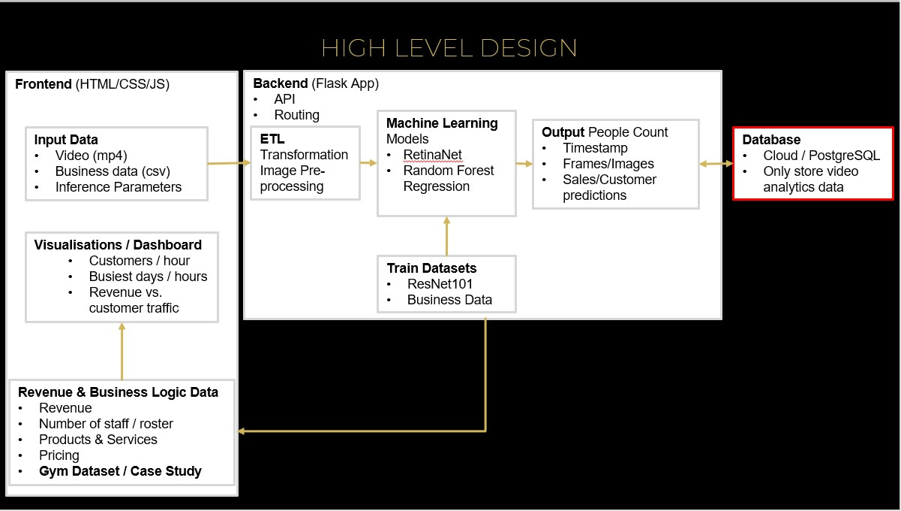

# BizzWatch
An app that analyses camera/video footage to audit business revenue and customers behaviour.

## Deployment
Demo [Live_link](https://bizzwatch.herokuapp.com/)

## Motivation
CCTV has been the goto solution to prevent employee or internal theft. Business managers can't be present at all times and are too busy to review hours of video footage. Employee theft continues to hinder profit margins for business owners, especially in most eveloping countries with average annual income is under US$ 3,000!

## Solution 
BizzWatch is a solution that leverages computer vision and data analytics to detect, audit and predict revenue/customer demand.

## Design

## Technology Stack

### Front End
* HTML
* CSS
* Javascript
* Bootstrap

### Back End
* Python
* Flask
* REST/API

### Machine Learning
* OpenCV
* Pytorch
* Retinanet_r101_fpn
* ResNet 101 backbone Neural Netowrk
* Pretrained COCO Weights

## Benefits
* Fraud Detection - object detection vs. ground-truth / prediction
* Sales / Customer Predicion - using influencing factors/features
* Resource Optmisation - staff, goods and services
  
## Future Works
* Cloud deployment - paid-tier, to allow upload of video and cloud inference
* Human Pose Estimation to identify activity
* Dwell Time - time object spends in a given user defined zone
* Zone Region of Interest - specify exact
* Video Stream - RTSP

## Development Time
* This project / minimum viable product was developed in an intense 2 Weeks before deadline of final bootcamp project.

## Author
Mwansa Mwango

## Acknowledgements
* [Simple MMDetector](https://github.com/akarazniewicz/smd)
* [Case Study - Crowdedness at the Campus Gym (Random Forest Regression](https://www.kaggle.com/nsrose7224/random-forest-regressor-accuracy-0-91)

